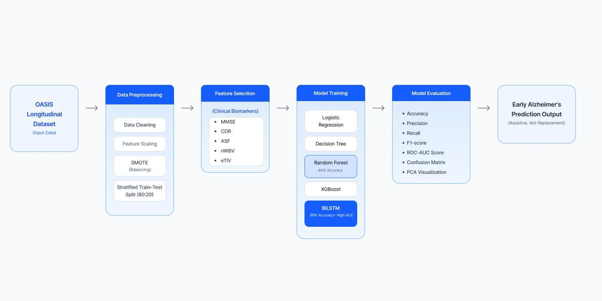
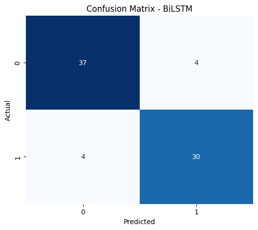
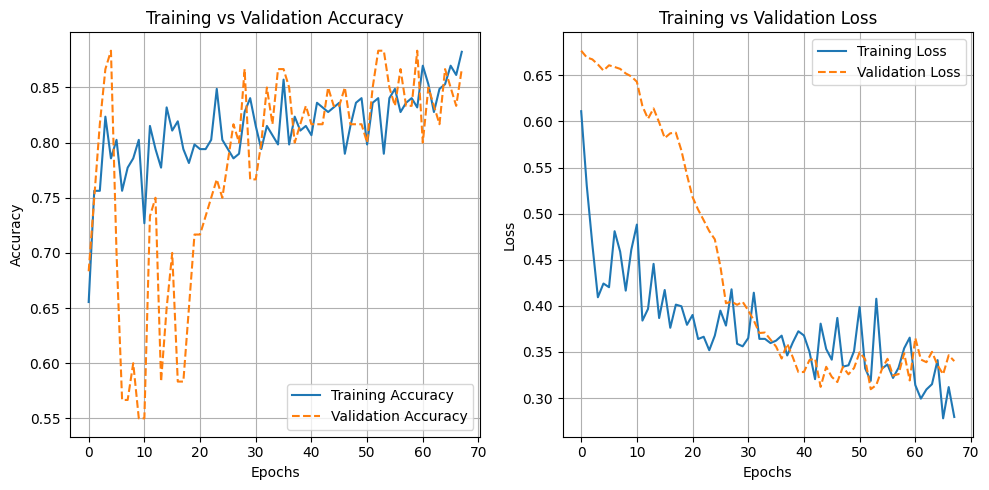
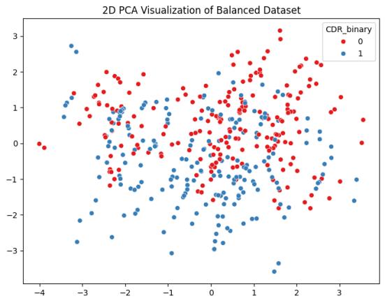

# Alzheimer Disease Detection using BiLSTM

Hybrid Ensemble Learning and BiLSTM Modeling for Early Alzheimer’s Disease Detection using OASIS Clinical Biomarkers.

## Project Overview
This project predicts early Alzheimer’s disease using machine learning and deep learning models trained on clinical biomarkers from the OASIS dataset.

The goal is to compare traditional machine learning models with a deep learning BiLSTM model to improve prediction accuracy.

## Dataset
OASIS Brain MRI Dataset  
https://www.oasis-brains.org/

## Project Architecture

The following diagram shows the workflow of the hybrid ML–DL framework used for early Alzheimer's disease detection.

## Models Used
- Logistic Regression
- Decision Tree
- Random Forest
- XGBoost
- Bidirectional LSTM (BiLSTM)

## Techniques Used
- Data preprocessing
- SMOTE class balancing
- Feature scaling
- Deep learning using BiLSTM

## Results

### Confusion Matrix

### Accuracy & Loss Graph

### PCA Visualization

## Technologies
Python, TensorFlow, Scikit-learn, Pandas, NumPy, Matplotlib

## How to Run
1. Install dependencies
2. Open the notebook `alzheimers_detection.ipynb`
3. Run all cells to train and evaluate the models
